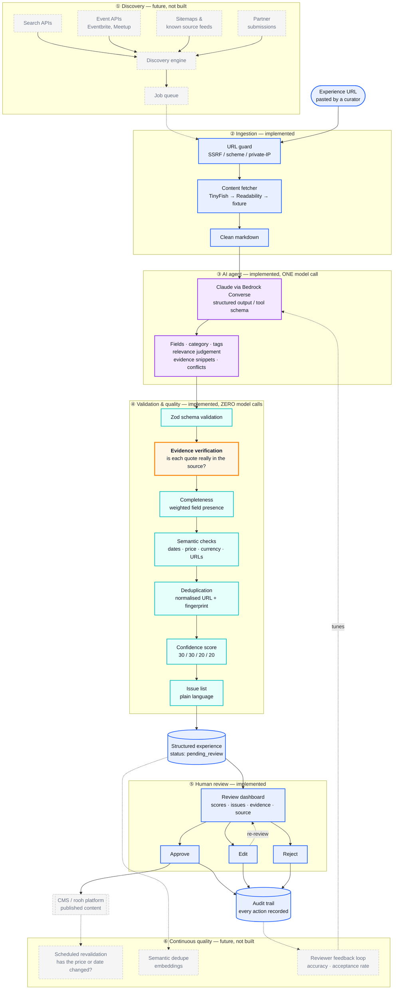
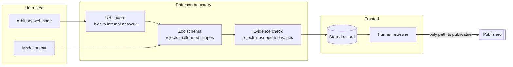

# Architecture

## System overview

Solid boxes are implemented in this POC. Dashed boxes are the production
architecture this is designed to grow into — they are deliberately not built.



**The colour split is the architectural argument.** Purple is the only place a
model runs. Teal is everything that decides whether to trust it, and it is all
ordinary deterministic code. Orange is the check the whole design rests on.

## The trust boundary



Two rules hold everywhere: nothing reaches storage without passing all three
gates, and nothing reaches publication without a human. There is no code path
that auto-approves, however high the scores.

## Request flow

`POST /api/analyze` runs synchronously — a fetch plus one model call, typically
5–15 seconds. There is no job queue because at one-URL-at-a-time there is
nothing to queue; discovery is what would introduce that need.

```
POST /api/analyze { url }
  │
  ├─ assertSafeUrl ................ scheme, credentials, DNS → public IP only
  ├─ extractContent ............... TinyFish → Readability → fixture
  ├─ extractExperience ............ ← the only model call
  ├─ LlmExtractionSchema.parse .... reject malformed output
  ├─ verifyEvidence ............... every snippet must exist in the source
  ├─ scoreCompleteness
  ├─ buildFingerprint + findDuplicate
  ├─ buildIssues .................. unsupported claims, conflicts, staleness
  ├─ scoreConfidence .............. computed, never asked of the model
  ├─ ExperienceSchema.parse ....... our own assembled record must validate too
  └─ createExperience ............. status = pending_review
```

## Data model

In this POC these three tables live in the browser, in a zustand store persisted
to localStorage (`src/stores/experienceStore.js`) — the server is stateless, so
a serverless instance never has to remember anything between requests. The shape
below is the shape we would ship; moving to Postgres means replacing that one
module and giving the server back its persistence role.

```sql
CREATE TABLE experiences (
    id                UUID PRIMARY KEY,
    title             TEXT        NOT NULL,
    description       TEXT        NOT NULL,
    category          TEXT        NOT NULL,   -- constrained to the taxonomy
    tags              TEXT[]      NOT NULL DEFAULT '{}',

    provider          JSONB       NOT NULL,   -- { name, website }
    location          JSONB       NOT NULL,   -- { name, address, city, country }
    schedule          JSONB       NOT NULL,   -- { start, end, timezone }
    pricing           JSONB       NOT NULL,   -- { amount, currency }

    source_url        TEXT        NOT NULL,
    normalized_url    TEXT        NOT NULL,   -- tracking params stripped
    source_type       TEXT        NOT NULL,   -- tinyfish | readability | fixture
    retrieved_at      TIMESTAMPTZ NOT NULL,

    is_relevant       BOOLEAN     NOT NULL,
    relevance_score   SMALLINT    NOT NULL,
    relevance_reason  TEXT        NOT NULL,

    confidence_score  SMALLINT    NOT NULL,
    confidence_parts  JSONB       NOT NULL,   -- the four sub-scores, for explainability
    evidence          JSONB       NOT NULL,   -- [{ field, value, snippet, verified }]
    missing_fields    TEXT[]      NOT NULL DEFAULT '{}',
    issues            TEXT[]      NOT NULL DEFAULT '{}',

    fingerprint       TEXT        NOT NULL,   -- title|provider|start|city hash
    duplicate_of      UUID        REFERENCES experiences(id),

    status            TEXT        NOT NULL DEFAULT 'pending_review',
    created_at        TIMESTAMPTZ NOT NULL DEFAULT now(),
    updated_at        TIMESTAMPTZ NOT NULL DEFAULT now()
);

-- Duplicate detection is two indexed lookups, not a scan.
CREATE INDEX idx_experiences_normalized_url ON experiences (normalized_url);
CREATE INDEX idx_experiences_fingerprint    ON experiences (fingerprint);
CREATE INDEX idx_experiences_status         ON experiences (status, created_at DESC);

-- What we fetched, kept separately so re-extraction can be compared over time.
CREATE TABLE sources (
    id            UUID PRIMARY KEY,
    experience_id UUID        NOT NULL REFERENCES experiences(id) ON DELETE CASCADE,
    url           TEXT        NOT NULL,
    content_hash  TEXT        NOT NULL,   -- detects "did the page change?"
    retrieved_at  TIMESTAMPTZ NOT NULL,
    source_type   TEXT        NOT NULL
);

-- Audit trail. Answers "who accepted what the model proposed, and when".
CREATE TABLE reviews (
    id            UUID PRIMARY KEY,
    experience_id UUID        NOT NULL REFERENCES experiences(id) ON DELETE CASCADE,
    action        TEXT        NOT NULL,   -- approve | reject | edit
    notes         TEXT,
    created_at    TIMESTAMPTZ NOT NULL DEFAULT now()
);
```

`content_hash` earns its place at V3: comparing it on a re-fetch tells us
whether a page actually changed before spending a model call re-extracting it.

## Confidence model

Confidence is arithmetic over four measurable signals, computed in
`src/server/quality/confidence.js`:

| Signal | Weight | What it measures |
|---|---|---|
| Completeness | 30% | Weighted share of important fields the page actually provided |
| Evidence coverage | 30% | Share of extracted values backed by a quote found in the source |
| Validation | 20% | Share of automated semantic checks that passed |
| Source quality | 20% | Content volume, real title, HTTPS, which extractor ran |

Evidence and completeness dominate because they measure the two failures that
actually reach a reviewer: invented values and missing ones.

Confidence is **not** relevance. Relevance asks "does this belong on rooh" and
the model answers it from the page. Confidence asks "is this data right" and we
answer it ourselves. A page can be highly relevant yet barely extractable.

## Scaling path

| Stage | Adds | Why then, not now |
|---|---|---|
| **V1 — here** | URL → structured → reviewed | Prove extraction is accurate enough to be worth automating |
| **V2** | Automated discovery from event APIs and known feeds | Only worth pointing at a pipeline whose output reviewers accept |
| **V3** | Background jobs, scheduled revalidation via `content_hash` | Needed once volume exceeds synchronous request handling |
| **V4** | Semantic duplicate resolution with embeddings | Exact fingerprints suffice until catalogue density makes near-duplicates common |
| **V5** | Personalization and recommendation | Requires a large, trustworthy, well-labelled catalogue first |
